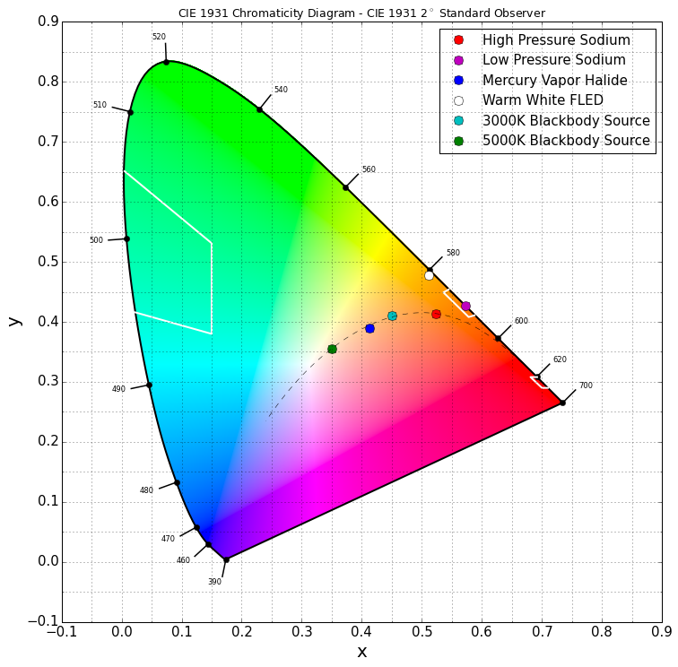

# Communicating about Color
[Color](./COLOR.WHAT.md) is a very abstract concept, for which under-specified discussions may have very real consequences. As a function of environment and impacted sensors, we often use need very different tools to communicate about color. The method we are most familiar with, is well visualized in the image below and to the left, authored by Randall Monroe of xkcd. Although computers have very specific descriptor languages for colors spanning one of these labeled sections, human need to communicate with each other most commonly doesn't need such high granularity.




Below is the code used to generate the [CIE chart](./src/notebooks/CIE%20Charts.ipynb) found to the upper right. Points included in the legend represent engineering specifications for specific light sources. The code below was used to generate this plot.

```python
from collections import namedtuple
from colour.plotting import CIE_1931_chromaticity_diagram_plot
import matplotlib.pyplot as plt
from pandas import read_csv
from numpy  import array, transpose

datafile = lambda filename: transpose(array(read_csv(filename)))
Blackbody_xy = datafile('./datasets/BlackBody_xy.csv')

legend = dict()
ColorPoint = namedtuple('ColorPoint', ['x', 'y', 'label'])
legend['ro'] = ColorPoint(0.464, 0.523, 'LE174-H00-N50-2A CW7 DOE')
legend['mo'] = ColorPoint(0.511, 0.477, 'LE174-H00-N30 (PC Cover CW8) DOE')
legend['bo'] = ColorPoint(0.531, 0.464, 'LE174-H00-N30-2A CW9 DOE')
legend['wo'] = ColorPoint(0.562, 0.432, 'PC Converted Amber LED')
legend['co'] = ColorPoint(0.450, 0.410, '3000K Blackbody Source')
legend['go'] = ColorPoint(0.350, 0.355, '5000K Blackbody Source')

def createPlot(**legend):
    CIE_1931_chromaticity_diagram_plot(standalone = False)

    plt.xlabel('x', fontsize=20)
    plt.ylabel('y', fontsize=20)
    plt.tick_params(axis='x', labelsize=15)
    plt.tick_params(axis='y', labelsize=15)

    for key in legend:
        point = legend[key]
        plt.plot(point.x, point.y, key,
                 markersize=10,
                 label=point.label)

    plt.plot(Blackbody_xy[0], Blackbody_xy[1], '--',
             color = 'black', linewidth = 0.5)

    plt.grid(True)
    plt.legend(loc=1, fontsize=15, numpoints=1)
    plt.xlim(-.1,.9), plt.ylim(-.1,.9)

    plt.show()

createPlot(**legend)
```

