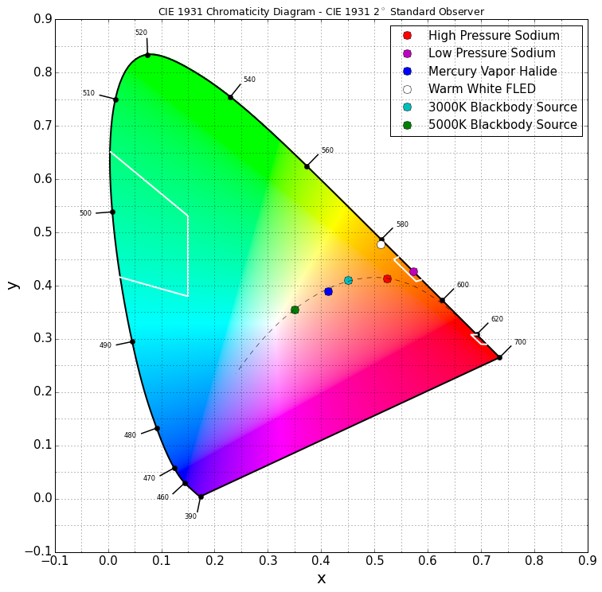
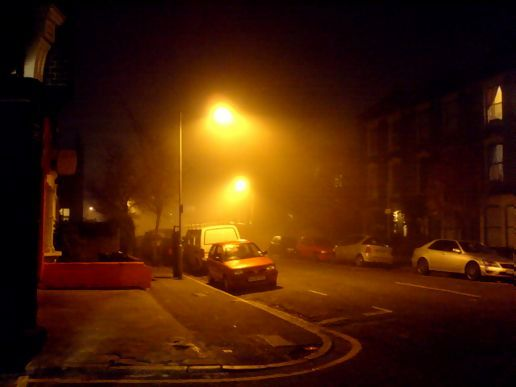
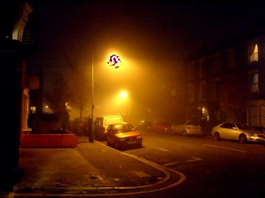

# Goals of this Course
This is a course on light and sensor systems. Although there are many topics in this space, we will primarily focus on light pollution and its impact on astronomy. By the end of this material, you should be able to reason and communicate clearly about light, environment, and sensor systems.

To insure you are supposed to be here, we first introduce the character audiences benefiting from participation. One character is the Scientist. The Scientist hopes to learn, then leverage programming in their field, to either model or better communicate their discipline. The second character is the Programmer. The Programmer hopes to understand the relationship between physical systems, measurement techniques, and computer models; growing their appreciation for real world constraints. Finally, our third character wants to know about light pollution, and strategies for communicating about sensor systems.

Participation in the programming materials, you are expected to have a brief understanding of programmng. We will record code walk-throughs which may include terms that are unfamilure to a non-programmer. We will, however, openly discuss some of our design decisions in a way that should help to grow a young programmer.

Hopefully, you consider yourself at least one of these characters. This material is intended to be accessible and digestible by any of these characters. As we understand that different characters will have different interests, we will present material separated into sections that you may navigate freely for your own purposes and interests.

For each section below we will link to material, either provided by others, or generated ourselves. For any section, this may include:
- References to relative articles
- Physical systems video lectures
- Programming video lectures
- Challenge problems to verify knowledge

# Color maps




## Approximation and Smoothing of Data

In physics courses, you are often told to approximate values in your models. In my first life, I thought this was only to accommodate the  the lazy physicist. In my second life, I thought this was a strategy to accommodate the limitations introduced by using computers. Although these are good answers, they do not respect the true value of approximation.

It is often our goal to measure, analyze, and communicate properties of physical systems such that the behavior of similar systems may be predicted. Measuring properties of a physical system is very difficult. Enormous time and cost is put into developing environments and tools to increase the accuracy of these measurements. When we do not have these resources, approximations can be used to smooth out the noise inherent to our instrumentation and environment.


## Example of Smoothing

Below is a source image of two street lamps taken at night. Our goal is to do math on these lamps in order to identify what the spectral profile of these lamps are. A first attempted approach is to compute the ratio of red to blue light stored in the image, by selecting clusters of high intensity light in those bands. Unfortunately, there are a lot of places for information to be corrupted.
- sensors are not perfect
- images produced are modified from raw format, in order to produce more human similar images
- resolution of the image results in a forced reduction of expressible sensors
- compression algorithm used to save the file to a computer may take liberties with individual pixels





On the left is the source image. The technique we used identified critical sections by clustering points of green at 255 intensity, with a minimum size of 100 points, and a minimum radial distance of 30. The middle image has not been modified, and only identifies one sparse cluster, which doesn't appreciate a realistic view of the world. With smoothing intensities of 240-255 into one bucket, we can produce much more useful results; as found on the right.  [DBSCAN](https://github.com/cloudwalkio/ddbscan) is the algorithm and python module that we are using for this.

```python
from lamplight import image_info
from lamplight import topograph_image, get_index_of, make_clusters_dict
from lamplight import colorize_clusters

filename = "file.jpeg"
img_type, name, src_image = image_info(filename)
step_gen  = step_range_gen(30)
top_image = topograph_image(src_image, step_gen)

def paint(image):
    points_dict  = get_index_of(image)
    cluster_dict = make_clusters_dict(points_dict, step_gen, 30, 100)

    channel, intensity = 1, next(step_gen.range) # green, 255
    clusters = cluster_dict[channel][intensity]

    return colorize_clusters(image, clusters)

save_top, save_src = paint(top_image), paint(src_image)
```
---

# For Project

- [markdown guide](https://help.github.com/articles/github-flavored-markdown/)
- [colormaps for oceanography](https://www.youtube.com/watch?v=XjHzLUnHeM0)
- [topographical maps](https://stackoverflow.com/questions/263305/drawing-a-topographical-map)
- [keyhole telescopes](https://en.wikipedia.org/wiki/KH-11_Kennan)
- [clustering techniques](http://scikit-learn.org/stable/auto_examples/cluster/plot_dbscan.html#example-cluster-plot-dbscan-py)
- [Data Structures for DDBand](https://en.wikipedia.org/wiki/Quadtree)
- [Names and Values in Python](https://www.youtube.com/watch?v=_AEJHKGk9ns)
- [LSP Video](https://www.youtube.com/watch?v=O7mEBpJVJbA)

# Goals of this repository
We are hoping to gather and develop lecture materials for a course we are designing **sensor systems and color pollution**.

## Outline
- Introduction
    - What is color
        - [Metamerism Wiki] (https://en.wikipedia.org/wiki/Metamerism_(color))
        - What is color history
    - How do sensory systems, capture light and color
        - What types elements produce refraction light
        - Ray tracing with refraction and reflection
    - Human eye
- Filters and content goals
- Types of sensor systems/architecture
    - Keck
    - Eye
    - Camera
- Noise
- **Raw vs processed Images from a camera**
- Signal Noise
    - Scattering (from system)
    - Atmospheric physics (from environment)
- Limiting pollution for your sensor
- Artificial Lighting
- Understanding the human market
    - What do humans want to see?
    - What noise is caused in their environment?
- Understanding the astronomy market
    - What do astronomers want to see?
    - What noise is caused in their environment?
    - Simplest solutions
        - No light
        - Low pressure sodium with filter
        - Other light options

