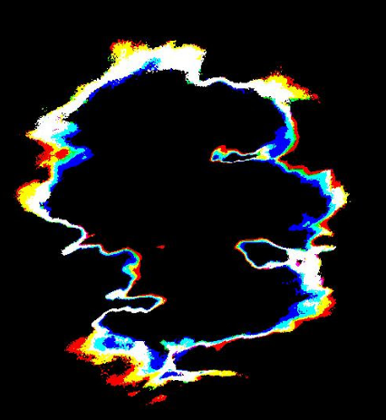

# Goals of this Course
In this course we develop a python program to analyse the rgb content of light sources in photographs to approximate their spectral profile. We will focus on
- reproducible research
- scalable hypothesis testing
- wide adoption/rejection of results (including distribution and data visualization)

The target audiences for this course are
- **Scientists** who want to leverage programming in their field, to build models and visualization tools.
- **Programmers** who want to understand the relationship between physical systems and measurement techniques.
- **Lighting Engineers and Photographers** who want to know how light impacts sensor systems.

For optional participation in the programming materials, you are expected to have some practical exposure to python. We have recorded code walk-throughs which include terms that may be unfamiliar to a non-programmer. We, however, openly discuss some of our algorithmic and design decisions. All of our code and data is publicly availible.

You should feel free to skip any sections that are not aligned with your interests. If you have comments about this material, please open a github issue.

# Motivation
There is a growing body of technical literature that report on the adverse effects artificial lighting has on various eco-systems, bio-sensory systems, or artificial sensors.  Examples of these topics include (along with reference materials):
- [Astronomy](#) (light pollution)
- [Human Health](#) (circadian rhythm)
- [Fish Behavior](#) (impacting population)
- [Bird Behavior](#) (impacting population)
- [Turtle Behavior](#) (impacting migration)
- [Insect Behavior](#)
- [Plant Life](#) (plant growth)

The primary [contributors](./AUTHORS.md) of this course have developed a tool that can be tailored to address any of the above topics.  However, you will see in the introduction section that we focusing our discussion towards light pollution and how it impacts data obtained by telescopes that use CCD (Charge Coupled Device) arrays.

---

# For Project
- [markdown guide](https://help.github.com/articles/github-flavored-markdown/)
- [colormaps for oceanography](https://www.youtube.com/watch?v=XjHzLUnHeM0)
- [topographical maps](https://stackoverflow.com/questions/263305/drawing-a-topographical-map)
- [keyhole telescopes](https://en.wikipedia.org/wiki/KH-11_Kennan)
- [clustering techniques](http://scikit-learn.org/stable/auto_examples/cluster/plot_dbscan.html#example-cluster-plot-dbscan-py)
- [Data Structures for DDBand](https://en.wikipedia.org/wiki/Quadtree)
- [Names and Values in Python](https://www.youtube.com/watch?v=_AEJHKGk9ns)
- [LSP Video](https://www.youtube.com/watch?v=O7mEBpJVJbA)
- [Talk about color blindness and cones](http://theneurosphere.com/2015/12/07/why-are-all-the-colours-we-experience-composed-of-three-primaries/)
- [Light Summary of Light Policy and Scotobiology](https://www.youtube.com/watch?v=qM7G4QG0JP4)
- [Python 2.7 vs Python 3](https://www.webucator.com/blog/2016/03/still-using-python-2-it-is-time-to-upgrade/)
- [Clustering In Python](https://www.youtube.com/watch?v=5cOhL4B5waU)

# Goals of this repository
We are hoping to gather and develop lecture materials for a course we are designing **sensor systems and color pollution**.

## Outline
- Introduction
    - What is color
        - [Metamerism Wiki] (https://en.wikipedia.org/wiki/Metamerism_(color))
        - What is color history
    - How do sensory systems, capture light and color
        - What types elements produce refraction light
        - Ray tracing with refraction and reflection
    - Human eye
- Types of sensor systems/architecture
    - Keck
    - Eye
    - Camera
- Filters for sensors
- Noise
- **Raw vs processed Images from a camera**
- Signal Noise
    - Scattering (from system)
    - Atmospheric physics (from environment)
- Limiting pollution for your sensor
- Artificial Lighting
- Understanding the human market
    - What do humans want to see?
    - What noise is caused in their environment?
- Understanding the astronomy market
    - What do astronomers want to see?
    - What noise is caused in their environment?
    - Simplest solutions
        - No light
        - Low pressure sodium with filter
        - Other light options

