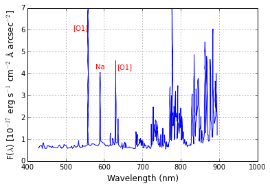

# Goals of this Course
In this course we develop a python program to analyse the rgb content of light sources in photographs to approximate their spectral profile. We will focus on creating tooling to enable
- reproducible research
- scalable hypothesis testing
- wide adoption/rejection of results (including distribution and data visualization)

The target audiences for this course are
- Scientists who want to leverage programming in their field, to build models and visualization tools.
- Programmers who want to understand the relationship between physical systems and measurement techniques.
- **Others** who want to know how light impacts sensor systems.

Participation in the programming materials, you are expected to have a brief understanding of programming. We will record code walk-troughs which may include terms that are unfamiliar to a non-programmer. We will, however, openly discuss some of our design decisions in a way that should help to grow a young programmer.

Hopefully, you consider yourself at least one of these characters. This material is intended to be accessible and digestible by any of these characters. As we understand that different characters will have different interests, we will present material separated into sections that you may navigate freely for your own purposes and interests.

If you have comments about this project, please open a github issue. You should feel free to skip any sections that are not aligned with your interests. Subsections may apear as hyperlinks that should only extend the current section's material.

# Introduction
Our project will grow your understanding of light and sensor systems. Although there are many topics in this space, we will primarily focus on how industries communicate their lighting needs. Our motivating example is a study of light pollution and impact to astronomy.

For each section below we will link to material, either provided by others, or generated ourselves. For any section, this may include:
- References to relative articles
- Physical systems video lectures
- Programming video lectures

# Project: Dark Sky Objectives for Terestrial Astronomy
In this project we discuss light polution's effect on terrestrial astronomy. Although we go into greater detail in other sections, we summarize this below.

## Background Information
The below image shows measurements of our atmosphere's natural light [emissions](YO DOG NEED WORKSHEET), (also known as night glow). We can observe that the Blue 400~550nm band (also known as g-prime band) has little natural emissions; where as the remaining terrestrial visible light spectrum has intense emissions.



```python
import numpy as np
import matplotlib.pyplot as plt

datafile = lambda filename: transpose(array(read_csv(filename)))
night_glow = datafile('./src/notebooks/datasets/Night_glow.csv')

plt.xlabel('Wavelength (nm)', fontsize = 12)
plt.ylabel('F($\lambda$) [10$^{-17}$ erg s$^{-1}$ cm$^{-2}$ $\AA$ arcsec$^{-2}$]', fontsize = 12)
plt.tick_params(axis='x', labelsize=10)
plt.tick_params(axis='y', labelsize=10)
plt.plot(night_glow[0], night_glow[1], '-', color = 'b', linewidth = 1)
plt.grid(True)
plt.annotate('[O1]', (520, 6),   color ='r')
plt.annotate( 'Na' , (580, 4.2), color ='r')
plt.annotate('[O1]', (635, 4.2), color ='r')
plt.xlim(400, 1000)
plt.show()
```

Although blue has low natural emissions, it scatters very easily in our atmosphere due to [rayleigh scattering](http://spaceplace.nasa.gov/blue-sky/en/) resulting in greater signal-noise in these bands. In order for telescopes to capture useful images, they filter out bands that have high signal-noise in the atmosphere. This results in less informative images, yielding lower return on investment.

It is exceptionally expensive to setup telescopes, and relocation is often not an option. In order to preserve their ability to contribute, astronomers join organizations like [International Dark Sky Association](http://darksky.org/) that lobby to influence public artificial lighting policies.

## Historical Consiquence of Language


---

# For Project
- [markdown guide](https://help.github.com/articles/github-flavored-markdown/)
- [colormaps for oceanography](https://www.youtube.com/watch?v=XjHzLUnHeM0)
- [topographical maps](https://stackoverflow.com/questions/263305/drawing-a-topographical-map)
- [keyhole telescopes](https://en.wikipedia.org/wiki/KH-11_Kennan)
- [clustering techniques](http://scikit-learn.org/stable/auto_examples/cluster/plot_dbscan.html#example-cluster-plot-dbscan-py)
- [Data Structures for DDBand](https://en.wikipedia.org/wiki/Quadtree)
- [Names and Values in Python](https://www.youtube.com/watch?v=_AEJHKGk9ns)
- [LSP Video](https://www.youtube.com/watch?v=O7mEBpJVJbA)
- [Talk about color blindness and cones](http://theneurosphere.com/2015/12/07/why-are-all-the-colours-we-experience-composed-of-three-primaries/)
- [Light Summary of Light Policy and Scotobiology](https://www.youtube.com/watch?v=qM7G4QG0JP4)
- [Python 2.7 vs Python 3](https://www.webucator.com/blog/2016/03/still-using-python-2-it-is-time-to-upgrade/)
- [Clustering In Python](https://www.youtube.com/watch?v=5cOhL4B5waU)

# Goals of this repository
We are hoping to gather and develop lecture materials for a course we are designing **sensor systems and color pollution**.

## Outline
- Introduction
    - What is color
        - [Metamerism Wiki] (https://en.wikipedia.org/wiki/Metamerism_(color))
        - What is color history
    - How do sensory systems, capture light and color
        - What types elements produce refraction light
        - Ray tracing with refraction and reflection
    - Human eye
- Types of sensor systems/architecture
    - Keck
    - Eye
    - Camera
- Filters for sensors
- Noise
- **Raw vs processed Images from a camera**
- Signal Noise
    - Scattering (from system)
    - Atmospheric physics (from environment)
- Limiting pollution for your sensor
- Artificial Lighting
- Understanding the human market
    - What do humans want to see?
    - What noise is caused in their environment?
- Understanding the astronomy market
    - What do astronomers want to see?
    - What noise is caused in their environment?
    - Simplest solutions
        - No light
        - Low pressure sodium with filter
        - Other light options

