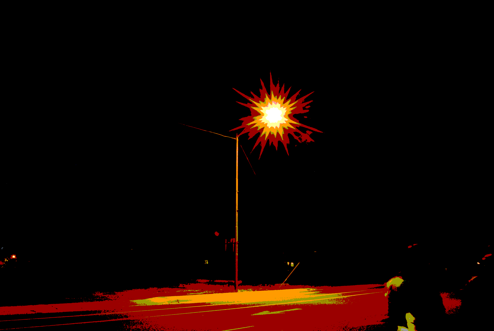

# Goals of this Material
In this course we develop a python program to analyse the rgb content of light sources in photographs to approximate their spectral profile. We will focus on
- reproducible research
- scalable hypothesis testing
- wide adoption/rejection of results (including distribution and data visualization)

The target audiences for this course are
- **Scientists** who want to leverage programming in their field, to build models and visualization tools.
- **Programmers** who want to understand the relationship between physical systems and measurement techniques.
- **Lighting Engineers and Photographers** who want to know how light impacts sensor systems.

For optional participation in the programming materials, you are expected to have some practical exposure to python. We have recorded code walk-throughs which include terms that may be unfamiliar to a non-programmer. We, however, openly discuss some of our algorithmic and design decisions. All of our code and data is publicly availible.

You should feel free to skip any sections that are not aligned with your interests. If you have comments about this material, please open a github issue.

# Motivation
There is a growing body of technical literature that report on the adverse effects artificial lighting has on various eco-systems, bio-sensory systems, or artificial sensors.  Examples of these topics include (along with reference materials):
- [Astronomy¹](./BIB.md) (light pollution)
- [Human Health²](./BIB.md) (immune system)
- [Fish Behavior³](./BIB.md) (impacting population)
- [Bird Behavior⁴](./BIB.md) (impacting population)
- [Turtle Behavior⁵](#) (impacting migration)
- [Insect Behavior⁶](#)
- [Plant Life⁷](#) (plant growth)

The primary [contributors](./AUTHORS.md) of this course have developed a tool that can be tailored to address any of the above topics.  However, you will see in the [Introduction](./ASTRO.md) section, that we are focusing the discussion on light pollution and how it impacts data obtained by telescopes that use CCD (Charge Coupled Device) arrays.

## Expectations
For each section below we will link to material, either provided by others, or generated ourselves. For any section, this may include:
- References to relative articles
- Physical systems video lectures
- Programming video lectures

## Table of Contents
1. [Introduction](./ASTRO.md)
2. [Measurement Equiptment](./SENSORS.md)
3. [What is in a photo](#)
4. [Hypothesis testing](./src/project/README.md)
5. [Conclusions](#)

