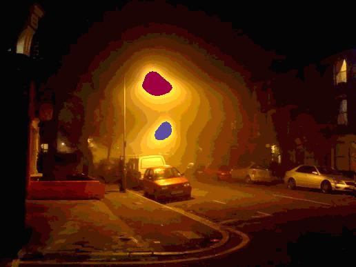

# Goals of this Course
This is a course on light and sensor systems. Although there are many topics in this space, we will primarily focus on light pollution and its impact on astronomy. By the end of this material, you should be able to reason and communicate clearly about light, environment, and sensor systems.

To insure you are supposed to be here, we first introduce the character audiences benefiting from participation. One character is the Scientist. The Scientist hopes to learn, then leverage programming in their field, to either model or better communicate their discipline. The second character is the Programmer. The Programmer hopes to understand the relationship between physical systems, measurement techniques, and computer models; growing their appreciation for real world constraints. Finally, our third character wants to know about light pollution, and strategies for communicating about sensor systems.

Participation in the programming materials, you are expected to have a brief understanding of programming. We will record code walk-troughs which may include terms that are unfamiliar to a non-programmer. We will, however, openly discuss some of our design decisions in a way that should help to grow a young programmer.

Hopefully, you consider yourself at least one of these characters. This material is intended to be accessible and digestible by any of these characters. As we understand that different characters will have different interests, we will present material separated into sections that you may navigate freely for your own purposes and interests.

For each section below we will link to material, either provided by others, or generated ourselves. For any section, this may include:
- References to relative articles
- Physical systems video lectures
- Programming video lectures
- Challenge problems to verify knowledge

## Why Python
Python was selected for this course because it is a language both primary [contributors](./AUTHORS.md) are familiar with. Python is a mature, simple, and expressive programming language. We have also found that there exists a large body of public prior work, that can be leveraged to decrease development release time.

Libraries we develop can be installed using pip as designated below:
```
pip install git+https://github.com/probinso/color-polution.git#subdirectory=src/project
```

To help with this course, my complete playlist of python tutorial videos can be found [here](https://www.youtube.com/playlist?list=PL96V6k-MWWMhAXQmH0AJDKM6WnfpaCx4S).

# Dark Sky Objectives for Telescopes
As a primary example used in this course we talk about light polutions effect on astronomy. In our material we defend that artificially produced blue light has greater impact on the astronomy industry than other wavelengths for terrestrial telescopes. Although we go into greater detail in other sections, this argument can be summarized below.

The below image shows measurements of our atmosphere's natural light [emissions](YO DOG NEED WORKSHEET), also known as night glow. We can observe that the Blue 400~550nm band has little natural emissions; where as the remaining terrestrial visible light spectrum has intense emissions.


Although blue is not naturally emitted, it scatters very easily in our atmosphere due to [rayleigh scattering](YO DOG rayleigh scattering). This is why artificial blue light so greatly impacts terrestrial viewing of the night sky. Bellow is the code used to generate that image.

```python
import numpy as np
import matplotlib.pyplot as plt

datafile = lambda filename: transpose(array(read_csv(filename)))
night_glow = datafile('./src/notebooks/datasets/Night_glow.csv')

plt.xlabel('Wavelength (nm)', fontsize = 12)
plt.ylabel('F($\lambda$) [10$^{-17}$ erg s$^{-1}$ cm$^{-2}$ $\AA$ arcsec$^{-2}$]', fontsize = 12)
plt.tick_params(axis='x', labelsize=10)
plt.tick_params(axis='y', labelsize=10)
plt.plot(night_glow[0], night_glow[1], '-', color = 'b', linewidth = 1)
plt.grid(True)
plt.annotate('[O1]', (520, 6),   color ='r')
plt.annotate( 'Na' , (580, 4.2), color ='r')
plt.annotate('[O1]', (635, 4.2), color ='r')
plt.xlim(400, 1000)
plt.show()
```

# Communicating about Color
[Color](./COLOR.md) is a very abstract concept, for which under-specified discussions may have very real consequences. As a function of environment and impacted sensors, we often use need very different tools to communicate about color. The method we are most familiar with, is well visualized in the image below and to the left, authored by Randall Monroe of xkcd. Although computers have very specific descriptor languages for colors spanning one of these labeled sections, human need to communicate with each other most commonly doesn't need such high granularity.


Below is the code used to generate the [CIE chart](./src/notebooks/CIE%20Charts.ipynb) found to the upper right. Points included in the legend represent engineering specifications for specific light sources. The code below was used to generate this plot.

```python
from collections import namedtuple
from colour.plotting import CIE_1931_chromaticity_diagram_plot
import matplotlib.pyplot as plt
from pandas import read_csv
from numpy  import array, transpose

datafile = lambda filename: transpose(array(read_csv(filename)))
Blackbody_xy = datafile('./datasets/BlackBody_xy.csv')

legend = dict()
ColorPoint = namedtuple('ColorPoint', ['x', 'y', 'label'])
legend['ro'] = ColorPoint(0.464, 0.523, 'LE174-H00-N50-2A CW7 DOE')
legend['mo'] = ColorPoint(0.511, 0.477, 'LE174-H00-N30 (PC Cover CW8) DOE')
legend['bo'] = ColorPoint(0.531, 0.464, 'LE174-H00-N30-2A CW9 DOE')
legend['wo'] = ColorPoint(0.562, 0.432, 'PC Converted Amber LED')
legend['co'] = ColorPoint(0.450, 0.410, '3000K Blackbody Source')
legend['go'] = ColorPoint(0.350, 0.355, '5000K Blackbody Source')

def createPlot(**legend):
    CIE_1931_chromaticity_diagram_plot(standalone = False)

    plt.xlabel('x', fontsize=20)
    plt.ylabel('y', fontsize=20)
    plt.tick_params(axis='x', labelsize=15)
    plt.tick_params(axis='y', labelsize=15)

    for key in legend:
        point = legend[key]
        plt.plot(point.x, point.y, key,
                 markersize=10,
                 label=point.label)

    plt.plot(Blackbody_xy[0], Blackbody_xy[1], '--',
             color = 'black', linewidth = 0.5)

    plt.grid(True)
    plt.legend(loc=1, fontsize=15, numpoints=1)
    plt.xlim(-.1,.9), plt.ylim(-.1,.9)

    plt.show()

createPlot(**legend)
```

# Approximation and Smoothing of Data

In physics courses, you are often told to approximate values in your models. In my first life, I thought this was only to accommodate the  the lazy physicist. In my second life, I thought this was a strategy to accommodate the limitations introduced by using computers. Although these are good answers, they do not respect the true value of approximation.

It is often our goal to measure, analyze, and communicate properties of physical systems such that the behavior of similar systems may be predicted. Measuring properties of a physical system is very difficult. Enormous time and cost is put into developing environments and tools to increase the accuracy of these measurements. When we do not have these resources, approximations can be used to smooth out the noise inherent to our instrumentation and environment.

## Example of Smoothing

Below is a source image of two street lamps taken at night. Our goal is to math on these lamps in order to identify what the spectral profile of these lamps are. A first attempted approach is to compute the ratio of red to blue light stored in the image, by selecting clusters of high intensity light in those bands. Unfortunately, there are a lot of places for information to be corrupted.
- sensors are not perfect
- images produced are modified from raw format, in order to produce more human similar images
- resolution of the image results in a forced reduction of expressible sensors
- compression algorithm used to save the file to a computer may take liberties with individual pixels

Click [here](./SENSORS.md) if you are concerned that photographs generated by digital cameras are not sufficient source material for addressing the above proposed problem.




On the left is the source image. The technique we used identified critical sections by clustering points of green at 255 intensity, with a minimum size of 100 points, and a minimum radial distance of 30. The middle image has not been modified, and only identifies one sparse cluster, which doesn't appreciate a realistic view of the world. With smoothing intensities of 230-255 into one bucket, we can produce much more useful results; as found on the right.  [DBSCAN](https://github.com/cloudwalkio/ddbscan) is the algorithm and python module that we are using for this.

```python
from lamplibs.lamplight import image_info
from lamplibs.lamplight import topograph_image, get_index_of, make_clusters_dict
from lamplibs.lamplight import colorize_clusters

filename = "file.jpeg"
img_type, name, src_image = image_info(filename)
step_gen  = step_range_gen(25)
top_image = topograph_image(src_image, step_gen)

def paint(image):
    points_dict  = get_index_of(image)
    cluster_dict = make_clusters_dict(points_dict, step_gen, 30, 100)

    channel, intensity = 1, next(step_gen) # green, 255
    clusters = cluster_dict[channel][intensity]

    return colorize_clusters(image, clusters)

save_top, save_src = paint(top_image), paint(src_image)
```

---

# For Project
- [markdown guide](https://help.github.com/articles/github-flavored-markdown/)
- [colormaps for oceanography](https://www.youtube.com/watch?v=XjHzLUnHeM0)
- [topographical maps](https://stackoverflow.com/questions/263305/drawing-a-topographical-map)
- [keyhole telescopes](https://en.wikipedia.org/wiki/KH-11_Kennan)
- [clustering techniques](http://scikit-learn.org/stable/auto_examples/cluster/plot_dbscan.html#example-cluster-plot-dbscan-py)
- [Data Structures for DDBand](https://en.wikipedia.org/wiki/Quadtree)
- [Names and Values in Python](https://www.youtube.com/watch?v=_AEJHKGk9ns)
- [LSP Video](https://www.youtube.com/watch?v=O7mEBpJVJbA)
- [Talk about color blindness and cones](http://theneurosphere.com/2015/12/07/why-are-all-the-colours-we-experience-composed-of-three-primaries/)
- [Light Summary of Light Policy and Scotobiology](https://www.youtube.com/watch?v=qM7G4QG0JP4)
- [Python 2.7 vs Python 3](https://www.webucator.com/blog/2016/03/still-using-python-2-it-is-time-to-upgrade/)
- [Clustering In Python](https://www.youtube.com/watch?v=5cOhL4B5waU)

# Goals of this repository
We are hoping to gather and develop lecture materials for a course we are designing **sensor systems and color pollution**.

## Outline
- Introduction
    - What is color
        - [Metamerism Wiki] (https://en.wikipedia.org/wiki/Metamerism_(color))
        - What is color history
    - How do sensory systems, capture light and color
        - What types elements produce refraction light
        - Ray tracing with refraction and reflection
    - Human eye
- Types of sensor systems/architecture
    - Keck
    - Eye
    - Camera
- Filters for sensors
- Noise
- **Raw vs processed Images from a camera**
- Signal Noise
    - Scattering (from system)
    - Atmospheric physics (from environment)
- Limiting pollution for your sensor
- Artificial Lighting
- Understanding the human market
    - What do humans want to see?
    - What noise is caused in their environment?
- Understanding the astronomy market
    - What do astronomers want to see?
    - What noise is caused in their environment?
    - Simplest solutions
        - No light
        - Low pressure sodium with filter
        - Other light options

