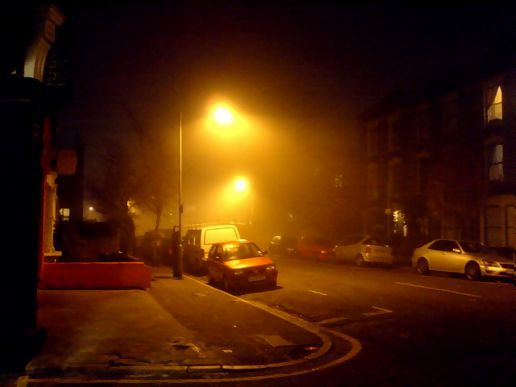

# Approximation and Smoothing of Data


In physics studies, you are encouraged to approximate values in your models. In my first life, I thought this was only to accommodate the  the lazy physicist. In my second life, I thought this was a strategy to accommodate the limitations introduced by using computers. Although these are good answers, they do not respect the true value of approximation.

It is often our goal to measure, analyze, and communicate properties of physical systems such that the behavior of similar systems may be predicted. Measuring properties of a physical system is very difficult. Enormous time and cost is put into developing environments and tools to increase the accuracy of these measurements. When we do not have these resources, approximations can be used to smooth out the noise inherent to our instrumentation and environment.

## Example of Smoothing

Below is a source image of two street lamps taken at night. Our goal is to math on these lamps in order to identify what the spectral profile of these lamps are. A first attempted approach is to compute the ratio of red to blue light stored in the image, by selecting clusters of high intensity light in those bands. Unfortunately, there are a lot of places for information to be corrupted.
- silicon sensors are not perfect; infact their quantum efficientcy is uneven accross wavelengths
- images produced are modified from raw format, in order to produce more human similar images
- resolution of the image results in a forced reduction of expressible sensors
- compression algorithm used to save the file to a computer may take liberties with individual pixels
- an observed maximum intensity implies, only, that the sensor has been saturated. We are unable to differentiate light whose intensity would register `maximum` vs `maximum+50`.

Click [here](./SENSORS.md) if you are concerned that photographs generated by digital cameras are not sufficient source material for addressing the above proposed problem.




On the left is the source image. The technique we used identified critical sections by clustering points of green at 255 intensity, with a minimum size of 100 points, and a minimum radial distance of 30. The middle image has not been modified, and only identifies one sparse cluster, which doesn't appreciate a realistic view of the world. With smoothing intensities of 230-255 into one bucket, we can produce much more useful results; as found on the right.  [DBSCAN](http://scikit-learn.org/stable/modules/generated/sklearn.cluster.DBSCAN.html) is the algorithm and python module that we are using for this.

```python
from lamplibs.lamplight import image_info
from lamplibs.lamplight import topograph_image, get_index_of, make_clusters_dict
from lamplibs.lamplight import colorize_clusters

filename = "file.jpeg"
img_type, name, src_image = image_info(filename)
step_gen  = step_range_gen(25)
top_image = topograph_image(src_image, step_gen)

def paint(image):
    points_dict  = get_index_of(image)
    radius, size = 30, 100
    cluster_dict = make_clusters_dict(points_dict, radius, size)

    channel, intensity = 1, next(step_gen) # green, 255
    clusters = cluster_dict[channel, intensity]

    return colorize_clusters(image, clusters)

save_top, save_src = paint(top_image), paint(src_image)
```
