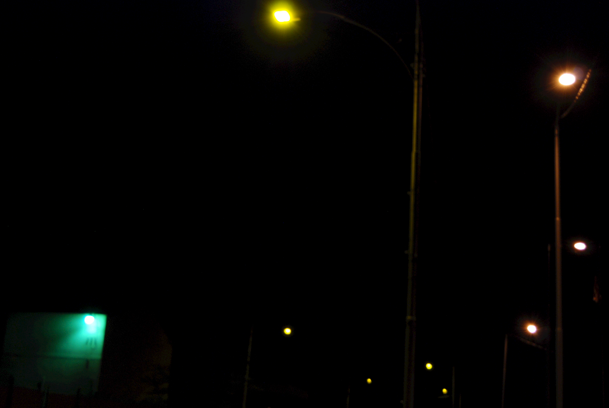
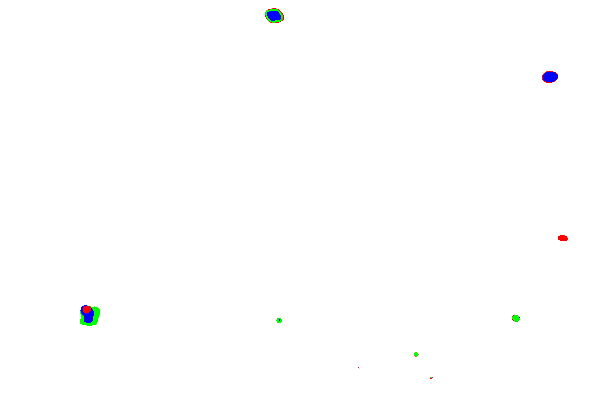

# Lamp (work in progress)
This is a program to automatically identify light source types from photographs taken at night. The program uses data smoothing and unsupervised learning techniques to classify light sources. 

Examples of light types:
- Moon
- Cool White LEDs
- Warm White LEDs
- High Pressure Sodium
- Low Pressure Sodium

### Current Status
This program takes as input night time images of lit street lamps. This generates an analysis of the RGB content and  relative position of each lamp.

This project is still a work in progress. The end product uses unsupervised classification techniques to label types of lamps. Every computationally expensive task result will be cached in a database using methods transparent to the user.

# Run without install of lamplibs
The program requires the following libraries to run:
- appdirs
- argcomplete
- argparse
- imread
- matplotlib
- numpy
- Pillow
- pony
- scipy
- scikit-learn
- dnf install libtiff{,-devel,-tools} libjpeg-turbo{,-devel,-utils} python3-numpy

To run the program without installation replace `lamp` with `./lamp-runner.py` in the examples, and ignore the Install section.

# Install lamplibs
Libraries we developed can be installed using pip as designated below:
```
$ pip install --upgrade git+https://github.com/probinso/color-polution.git@master#subdirectory=src/project
```
Or if downloaded locally
```
$ pip install --upgrade .
```
To uninstall
```
$ pip uninstall lamplibs
```

# What it does?
Once installed, commands and subcommands can be run, as described, using
```
$ lamp --help
```
The `topograph` subcommand produces a topographical leveling of an input image. This is used to standardize yield accross multiple input's with lossy compression filetypes. This intermediate step always yields a png (because it's lossless) that is cached in a database to prevent repeat work. Output images often look very similar, unless step size is very large.
```
$ lamp topograph  ./demo/0.JPG . --step 10  # produces output.png
$ mv ./output.png ./demo/1.png
```
 

The `cluster` subcommand identifies lamps by using **dbscan** in each color channel (red-green-blue) over high intensity values. The area of each cluster represents the measured output of a lamp in each channel. **Lamps** are grouped clusters from each channel that share the most overlapping area. The **relative position** of a lamp is the **medoid** of it's smallest cluster. This command yields a *splat image* to help visualize lamps, and prints **relative position** and **feature vector** of lamps.
```
$ lamp cluster    ./demo/1.png . --size 20 --radius 30  # produces output.png
visiting lamp : 0
{0: 0.5656422936535971, 1: 0.32673966796185094, 2: 0.10761803838455199, 'medoid': Coord(x=1563, y=3687)}
visiting lamp : 1
{0: 0.47934299239707356, 1: 0.13312293788552576, 2: 0.3875340697174007, 'medoid': Coord(x=1563, y=3686)}
visiting lamp : 2
{0: 0.08901918976545842, 1: 0.604846645891422, 2: 0.3061341643431196, 'medoid': Coord(x=1563, y=3686)}
visiting lamp : 3
{0: 0.14389668283728857, 1: 0.5423495476596303, 2: 0.31375376950308115, 'medoid': Coord(x=2031, y=568)}
visiting lamp : 4
{0: 0.37881340071121095, 1: 0.308815272318922, 2: 0.31237132696986714, 'medoid': Coord(x=2088, y=3380)}
visiting lamp : 5
{0: 0.49027635619242577, 1: 0.44933469805527126, 2: 0.06038894575230297, 'medoid': Coord(x=2100, y=1831)}
visiting lamp : 6
{0: 0.5291943828529194, 1: 0.4708056171470806, 2: 0.0, 'medoid': Coord(x=2325, y=2726)}
visiting lamp : 7
{0: 1.0, 1: 0.0, 2: 0.0, 'medoid': Coord(x=2414, y=2351)}
visiting lamp : 8
{0: 0.867579908675799, 1: 0.1324200913242009, 2: 0.0, 'medoid': Coord(x=2476, y=2828)}

$ mv ./output.png ./demo/2.png
```
 

The `purge` subcommand purges your system of the existing caching database.
```bash
$ ./lamp purge
are you sure you want to purge? (y/n): y
store purged
```

# Why Python
Python was selected for this course because it is a language both primary [contributors](../../AUTHORS.md) are familiar with. Python is a mature, simple, and expressive programming language. Python also has a large body of public prior work, that we leverage to decrease development release time.

Although most work in this repository is done in python3, there is may be some legacy python2.7 code that we will tend to as needed. We strongly encourage the use of python3 at this point. [Here](https://www.webucator.com/blog/2016/03/still-using-python-2-it-is-time-to-upgrade/) is a nice article about adoption of python3.

To help with this course, the complete playlist of python tutorial videos can be found [here](https://www.youtube.com/playlist?list=PL96V6k-MWWMhAXQmH0AJDKM6WnfpaCx4S). This will be broken into smaller topical lists on the youtube channel [here](https://www.youtube.com/channel/UC-EKRSRFcQ1Uda8oGVVZl7Q).
